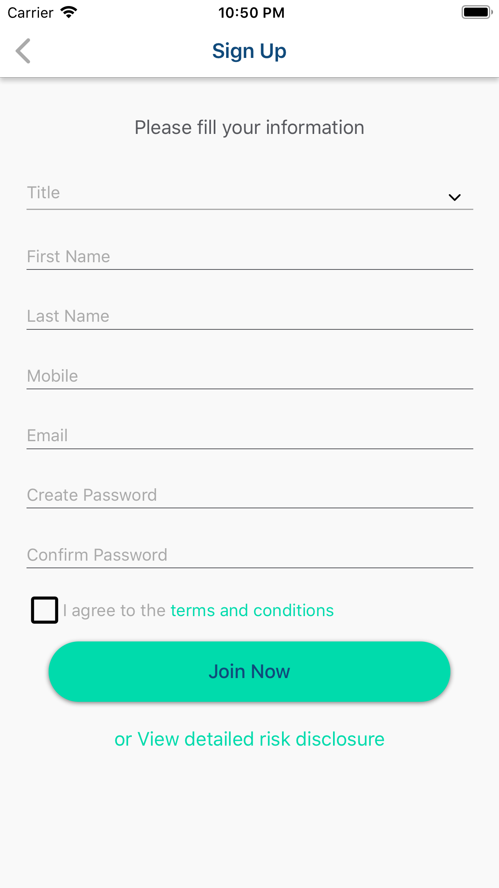

<h1 align="center"><b> Marketplace React Native App </b> </h1>

A minimal, clean and beautiful mobile app to help people find the jobs to book and change the world.

<i>"How to save a life?"-The Shoping Job</i> 

  
  
  
  

  <a href="#blush-overview">Overview</a> •
  <a href="#dizzy-roadmap">Roadmap</a> •
  <a href="#wrench-install-instructions">Install</a> •
  <a href="#zap-tech-stack">Tech Stack</a> •
  <a href="#iphone-Test">Test</a> •
  <a href="#eyes-version">Version</a> 

  <kbd>
    
  </kbd>
  &nbsp;&nbsp;&nbsp;&nbsp;
  <kbd>
    
  </kbd>
  &nbsp;&nbsp;&nbsp;&nbsp;
  <kbd>
    
  </kbd>
    
  <kbd>
    
  </kbd>
    &nbsp;&nbsp;&nbsp;&nbsp;
  <kbd>
    
  </kbd>
    &nbsp;&nbsp;&nbsp;&nbsp;
  <kbd>
    
  </kbd>
      
  <kbd>
    
  </kbd>
    &nbsp;&nbsp;&nbsp;&nbsp;
  <kbd>
    
  </kbd>
    &nbsp;&nbsp;&nbsp;&nbsp;

## :blush: **Overview?**

MarketPlace is the shoping app to find a job both employer and worker. It will be very comfortable to search jobs in Singapore and Malaysia.

## :dizzy: **Roadmap**

-   [x] Make it work on IOS
-   [x] Make it work on Android
-   [x] Make it work on Typescript
-   [x] Payment Integration
-   [x] Search Job
-   [x] Transform into responsive
-   [x] Update to latest React Native version

## :wrench: **Install instructions**

### Getting Started

#### 1) Clone & Install Dependencies

- 1.1) `git clone https://github.com/funnyjerry/marketplace.git`
- 1.2) `cd marketplace` - cd into your newly created project directory.
- 1.3) Install NPM packages with `yarn install`
        **Note:** NPM has issues with React Native so `yarn` is recommended over `npm`.
- 1.4) **[iOS]** `cd ios` and run `pod install` - if you don't have CocoaPods you can follow [these instructions](https://guides.cocoapods.org/using/getting-started.html#getting-started) to install it.
- 1.5) **[Android]** If you haven't already generated a `debug.keystore` file you will need to complete this step from within the `/android/app` folder. Run `keytool -genkey -v -keystore debug.keystore -storepass android -alias androiddebugkey -keypass android -keyalg RSA -keysize 2048 -validity 10000`

#### 2) Start your app

- 2.1) **[iOS]** Build and run the iOS app, run `react-native run-ios` (to run on simulator) or `react-native run-ios --device` (to run on real device) from the root of your project. The first build will take some time.
- 2.2) **[Android]** If you haven't already got an android device attached/emulator running then you'll need to get one running (make sure the emulator is with Google Play / APIs). When ready run `react-native run-android` from the root of your project.

## :zap: **Tech Stack**

<h1 align="center">
  
  
  
  
  

   
</h1>

-   [React Native](https://github.com/facebook/react-native)
-   [Eslint](https://eslint.org/)
-   [Redux](https://github.com/reduxjs/react-redux)
-   [Formik + Yup](https://jaredpalmer.com/formik/)
-   [Redux-Persist](https://github.com/rt2zz/redux-persist)
-   [Antd Mobile RN](https://github.com/ant-design/ant-design-mobile-rn)
-   [Lottie React Native](https://github.com/react-native-community/lottie-react-native)
-   [React Native Firebase](https://github.com/invertase/react-native-firebase)

## :iphone: **Test**

- [x] Test on Android
- [x] Test on iOS

## :eyes: **Version**
- [ ] React-Native 
- [x] Expo 35
